# Oakhampton Autonomous Commerce Architecture

Updated: 2026-07-21

## Operating map

```mermaid
flowchart LR
  A[Owned site, APIs, email, marketplaces, Reddit] --> B[Discovery adapters]
  B --> C[Deduplication and platform policy]
  C --> D[Qualification and risk screen]
  D --> E[Scope, effort and margin gate]
  E --> F[Specific proposal]
  F --> G{Submission authority}
  G -->|Allowed| H[Submit]
  G -->|Approval required| I[OpenClaw approval queue]
  H --> J[Unified customer inbox]
  I --> J
  J --> K[Scope and acceptance contract]
  K --> L[Stripe or Base USDC]
  L --> M[Verified payment]
  M --> N[Secure paid intake]
  N --> O[Order activation]
  O --> P{50% margin and effort gate}
  P -->|Pass| Q[Isolated fulfilment workspace]
  P -->|Fail| R[Re-scope and owner escalation]
  Q --> S[Low-cost model or OpenClaw specialist]
  S --> T[Tests, evaluation and manifest]
  T --> U[Delivery review and customer handoff]
  U --> V[Acceptance, revision or support]
  V --> W[Contribution and funnel ledger]
  W --> A
```

## Implemented control points

- The durable supervisor discovers work, reads customer messages and uses idempotent leased jobs.
- Platform definitions state permitted discovery, AI disclosure, submission and off-platform contact behaviour.
- Paid orders are activated from verified card or USDC events and wait for secure intake.
- Intake is converted to an offer-specific scope, effort estimate and predicted gross margin.
- Work exceeding the package hour budget or 50% margin floor is stopped for re-scoping.
- Accepted paid work is routed to an isolated fulfilment plan and model gateway.
- Completed model work is retained as a delivery-review record with manifest and usage evidence.
- Daily retention removes paid-intake files after the promised deletion date using a constrained ULID path.
- Fifteen-minute operational snapshots track queue age, dead letters, funnel events and settled contribution.
- Queue age over 15 minutes or any dead letter is escalated to OpenClaw.

## Remaining approval-gated boundaries

- Browser-marketplace submissions remain approval-gated where platform terms require it.
- Customer delivery remains review-gated until a customer-facing delivery portal and outbound adapter are verified end to end.
- Recurring plans remain manually contracted until Stripe subscription webhooks and entitlement accounting are implemented.
- Worker spawning remains subject to profitability, refund, complaint and maximum-worker controls.

## Required service levels

| Stage | Target | Escalation |
|---|---:|---|
| Discovery | every 15 minutes | adapter unhealthy for 3 runs |
| Customer messages | every 5 minutes | urgent award/interview immediately |
| Payment scan | every minute | mismatch or ambiguous invoice |
| Paid activation | under 5 minutes | no intake link/order state |
| Queue | oldest item under 15 minutes | OpenClaw queue alert |
| File retention | daily | deletion failure |
| Operating snapshot | every 15 minutes | dead letter or stale queue |

## Price and capacity policy

- Founding prices are GST-inclusive for the first ten completed engagements.
- Package hour budgets are 2, 6, 10 and 16 hours.
- Automatically accepted work must retain at least 50% predicted gross margin.
- Third-party usage and materially expanded scope are excluded unless explicitly included.
- Pricing is reviewed after ten projects or 90 days using conversion, actual delivery hours, support load, refunds and contribution margin.
